# Diagram Sistem

> Semua diagram dalam format Mermaid. Render di [mermaid.live](https://mermaid.live), GitHub/GitLab markdown, atau VS Code (extension Mermaid Preview).

---

## 1. Pipeline Sistem (NLP & ML)

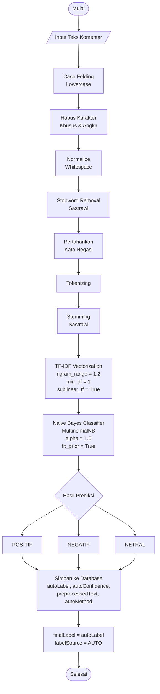

---

## 2. Flowchart Sistem

### 2.1 Flowchart Fitur Login & Autentikasi

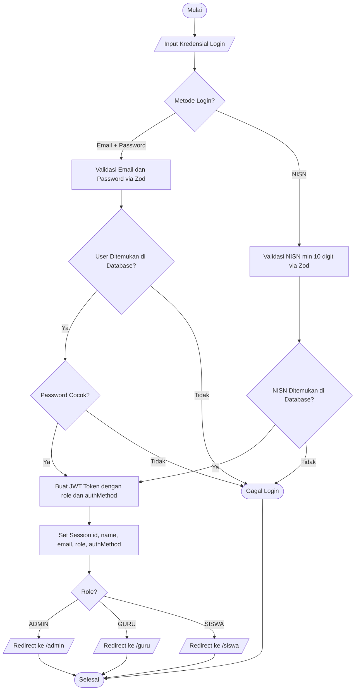

---

### 2.2 Flowchart Fitur Manajemen Data Guru

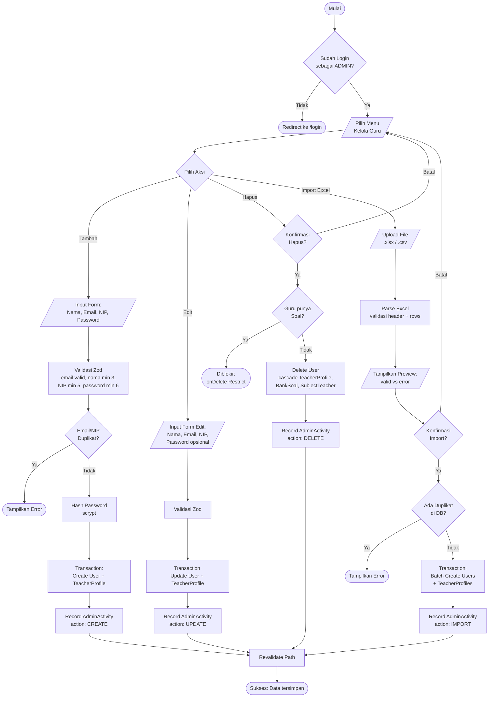

---

### 2.3 Flowchart Fitur Manajemen Data Siswa

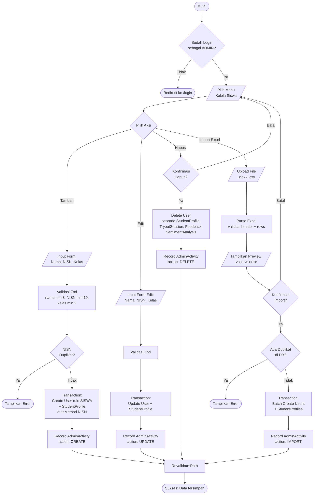

---

### 2.4 Flowchart Fitur Manajemen Mata Pelajaran & Pengampu

```mermaid
flowchart TD
    Start([Mulai]) --> Auth{Sudah Login<br/>sebagai ADMIN?}
    Auth -->|Tidak| Login([Redirect ke /login])
    Auth -->|Ya| Menu{Pilih Menu}

    Menu -->|Kelola Mapel| MapelFlow
    Menu -->|Kelola Pengampu| PengampuFlow

    %% === MAPEL FLOW ===
    subgraph MapelFlow ["Alur Mata Pelajaran"]
        direction TD
        MapelAction{Pilih Aksi}

        MapelAction -->|Tambah| FormMapel[/Input:<br/>Nama, Deskripsi, Status/]
        FormMapel --> ValidateMapel[Validasi Zod<br/>nama min 3]
        ValidateMapel --> CheckName{Name Duplikat?}
        CheckName -->|Ya| ErrMapel([Error])
        CheckName -->|Tidak| CreateMapel[Create Subject]
        CreateMapel --> LogCreate[Record AdminActivity<br/>action: CREATE]
        LogCreate --> RevalMapel[Revalidate]

        MapelAction -->|Edit| FormEditMapel[/Input Edit Mapel/]
        FormEditMapel --> UpdateMapel[Update Subject]
        UpdateMapel --> LogUpdateMapel[Record AdminActivity<br/>action: UPDATE]
        LogUpdateMapel --> RevalMapel

        MapelAction -->|Toggle Status| ToggleMapel[Update isActive<br/>true/false]
        ToggleMapel --> LogToggle[Record AdminActivity<br/>action: TOGGLE]
        LogToggle --> RevalMapel

        MapelAction -->|Hapus| ConfirmMapel{Konfirmasi?}
        ConfirmMapel -->|Ya| DeleteMapel[Delete Subject<br/>cascade: Question, BankSoal,<br/>Tryout, Feedback, SentimentAnalysis]
        DeleteMapel --> LogDeleteMapel[Record AdminActivity<br/>action: DELETE]
        LogDeleteMapel --> RevalMapel
    end

    %% === PENGAMPU FLOW ===
    subgraph PengampuFlow ["Alur Guru Pengampu"]
        direction TD
        PengampuAction{Pilih Aksi}

        PengampuAction -->|Assign| FormAssign[/Pilih Mapel<br/>+ Pilih Guru/]
        FormAssign --> ValidateAssign[Validasi Zod<br/>subjectId + teacherId]
        ValidateAssign --> CheckAssign{Relasi sudah<br/>ada?}
        CheckAssign -->|Ya| ErrAssign([Error])
        CheckAssign -->|Tidak| CreateAssign[Create SubjectTeacher]
        CreateAssign --> LogAssign[Record AdminActivity<br/>action: CREATE]
        LogAssign --> RevalAssign[Revalidate]

        PengampuAction -->|Hapus| ConfirmAssign{Konfirmasi?}
        ConfirmAssign -->|Ya| DeleteAssign[Delete SubjectTeacher]
        DeleteAssign --> LogDelAssign[Record AdminActivity<br/>action: DELETE]
        LogDelAssign --> RevalAssign
    end

    RevalMapel --> End([Selesai])
    RevalAssign --> End
```

---

### 2.5 Flowchart Fitur Manajemen Bank Soal & Tryout

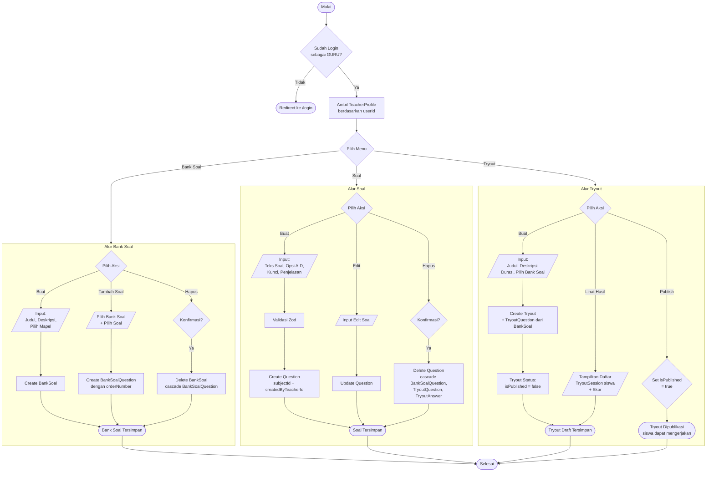

---

### 2.6 Flowchart Fitur Pengerjaan Tryout

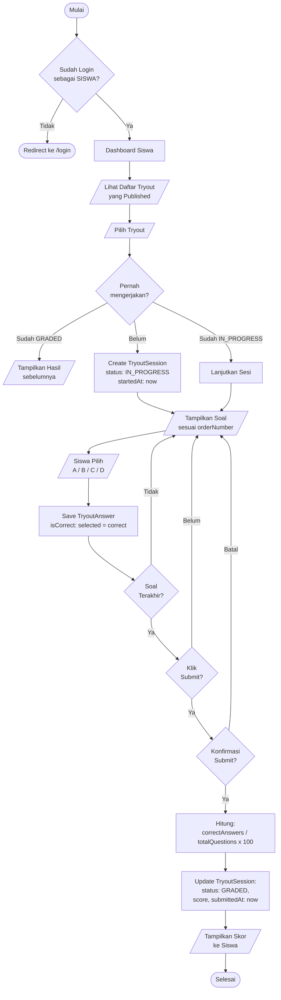

---

### 2.7 Flowchart Fitur Feedback & Analisis Sentimen

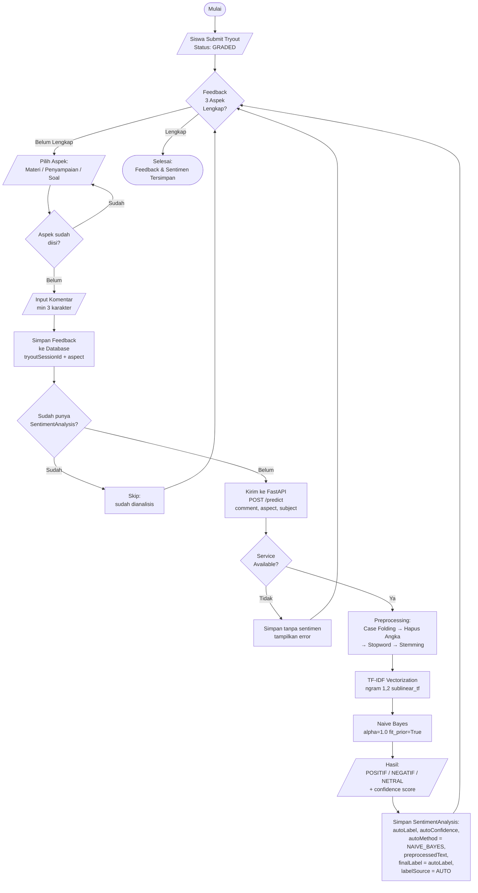

---

### 2.8 Flowchart Fitur Review & Override Sentimen

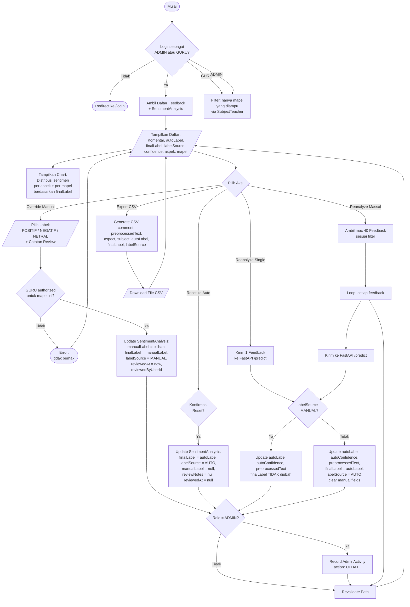

---

## 3. Use Case Diagram

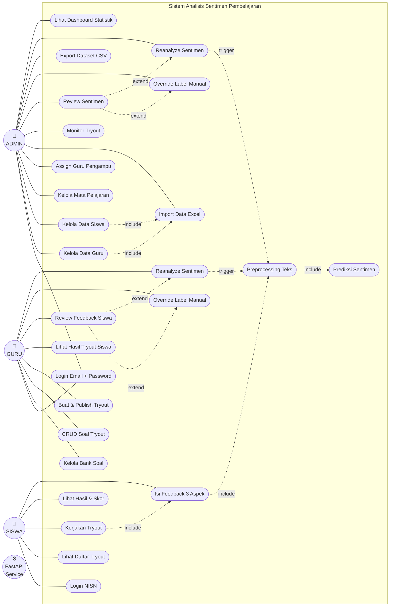

---

## 4. Activity Diagram

### 4.1 Activity Diagram: Alur Tryout Siswa

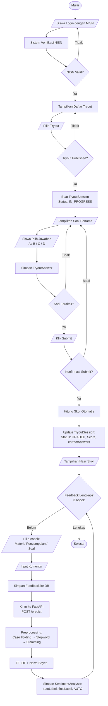

### 4.2 Activity Diagram: Review & Override Sentimen (Admin/Guru)

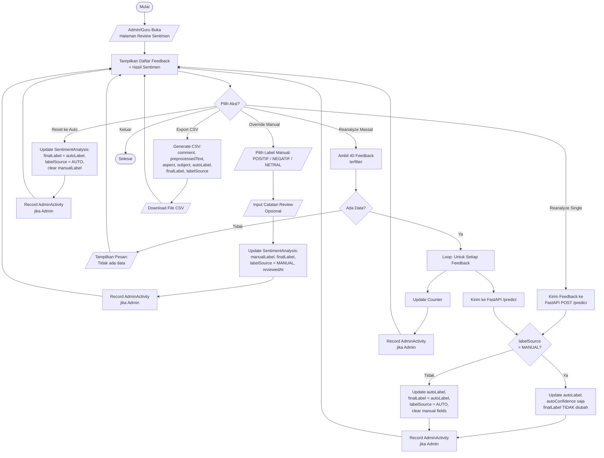

---

## 5. Entity Relationship Diagram (ERD)

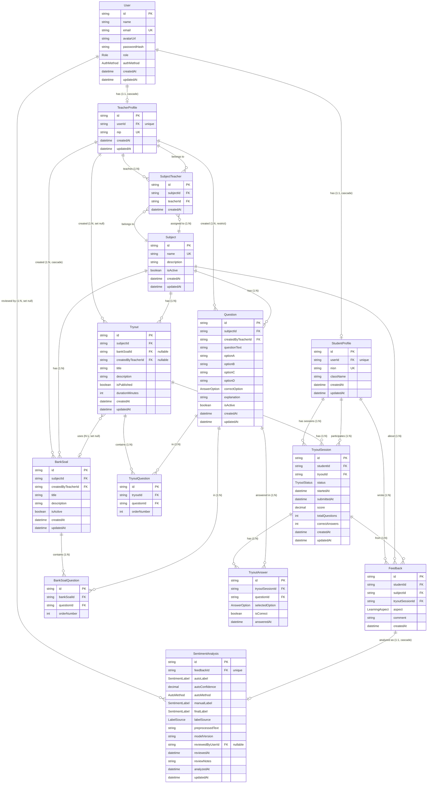

---

## 6. Struktur Database

### Enum

| Enum           | Nilai                          |
| -------------- | ------------------------------ |
| Role           | ADMIN, GURU, SISWA             |
| AuthMethod     | EMAIL_PASSWORD, NISN           |
| AnswerOption   | A, B, C, D                     |
| TryoutStatus   | IN_PROGRESS, SUBMITTED, GRADED |
| LearningAspect | MATERI, PENYAMPAIAN, SOAL      |
| SentimentLabel | POSITIF, NEGATIF, NETRAL       |
| LabelSource    | AUTO, MANUAL                   |
| AutoMethod     | LEXICON, NAIVE_BAYES           |

### Tabel: User

| Field        | Tipe       | Constraint         | Keterangan               |
| ------------ | ---------- | ------------------ | ------------------------ |
| id           | String     | PK, default cuid() | ID unik user             |
| name         | String     | NOT NULL           | Nama lengkap             |
| email        | String     | UNIQUE, nullable   | Email admin/guru         |
| avatarUrl    | String     | nullable           | URL foto profil          |
| passwordHash | String     | nullable           | Hash scrypt (admin/guru) |
| role         | Role       | NOT NULL           | ADMIN / GURU / SISWA     |
| authMethod   | AuthMethod | NOT NULL           | EMAIL_PASSWORD / NISN    |
| createdAt    | DateTime   | default now()      | Timestamp dibuat         |
| updatedAt    | DateTime   | @updatedAt         | Timestamp update         |

**Index:** `role`, `authMethod`

### Tabel: TeacherProfile

| Field     | Tipe     | Constraint                             | Keterangan          |
| --------- | -------- | -------------------------------------- | ------------------- |
| id        | String   | PK, default cuid()                     | ID unik profil guru |
| userId    | String   | FK → User.id, UNIQUE, onDelete Cascade | Relasi ke User      |
| nip       | String   | UNIQUE, NOT NULL                       | Nomor Induk Pegawai |
| createdAt | DateTime | default now()                          |                     |
| updatedAt | DateTime | @updatedAt                             |                     |

### Tabel: StudentProfile

| Field     | Tipe     | Constraint                             | Keterangan                 |
| --------- | -------- | -------------------------------------- | -------------------------- |
| id        | String   | PK, default cuid()                     | ID unik profil siswa       |
| userId    | String   | FK → User.id, UNIQUE, onDelete Cascade | Relasi ke User             |
| nisn      | String   | UNIQUE, NOT NULL                       | Nomor Induk Siswa Nasional |
| className | String   | NOT NULL                               | Nama kelas                 |
| createdAt | DateTime | default now()                          |                            |
| updatedAt | DateTime | @updatedAt                             |                            |

**Index:** `className`

### Tabel: Subject

| Field       | Tipe     | Constraint         | Keterangan             |
| ----------- | -------- | ------------------ | ---------------------- |
| id          | String   | PK, default cuid() | ID unik mata pelajaran |
| name        | String   | UNIQUE, NOT NULL   | Nama mapel             |
| description | String   | nullable, Text     | Deskripsi mapel        |
| isActive    | Boolean  | default true       | Status aktif           |
| createdAt   | DateTime | default now()      |                        |
| updatedAt   | DateTime | @updatedAt         |                        |

**Index:** `isActive`

### Tabel: SubjectTeacher

| Field     | Tipe     | Constraint                               | Keterangan         |
| --------- | -------- | ---------------------------------------- | ------------------ |
| id        | String   | PK, default cuid()                       | ID unik assignment |
| subjectId | String   | FK → Subject.id, onDelete Cascade        |                    |
| teacherId | String   | FK → TeacherProfile.id, onDelete Cascade |                    |
| createdAt | DateTime | default now()                            |                    |

**Unique:** `[subjectId, teacherId]`
**Index:** `teacherId`

### Tabel: Question

| Field              | Tipe         | Constraint                                | Keterangan                                |
| ------------------ | ------------ | ----------------------------------------- | ----------------------------------------- |
| id                 | String       | PK, default cuid()                        | ID unik soal                              |
| subjectId          | String       | FK → Subject.id, onDelete Cascade         |                                           |
| createdByTeacherId | String       | FK → TeacherProfile.id, onDelete Restrict | Tidak bisa hapus guru jika masih ada soal |
| questionText       | String       | NOT NULL, Text                            | Pertanyaan                                |
| optionA            | String       | NOT NULL, Text                            | Opsi A                                    |
| optionB            | String       | NOT NULL, Text                            | Opsi B                                    |
| optionC            | String       | NOT NULL, Text                            | Opsi C                                    |
| optionD            | String       | NOT NULL, Text                            | Opsi D                                    |
| correctOption      | AnswerOption | NOT NULL                                  | Kunci jawaban                             |
| explanation        | String       | nullable, Text                            | Penjelasan jawaban                        |
| isActive           | Boolean      | default true                              | Status aktif                              |
| createdAt          | DateTime     | default now()                             |                                           |
| updatedAt          | DateTime     | @updatedAt                                |                                           |

**Index:** `[subjectId, isActive]`, `createdByTeacherId`

### Tabel: BankSoal

| Field              | Tipe     | Constraint                               | Keterangan        |
| ------------------ | -------- | ---------------------------------------- | ----------------- |
| id                 | String   | PK, default cuid()                       | ID unik bank soal |
| subjectId          | String   | FK → Subject.id, onDelete Cascade        |                   |
| createdByTeacherId | String   | FK → TeacherProfile.id, onDelete Cascade |                   |
| title              | String   | NOT NULL                                 | Judul bank soal   |
| description        | String   | nullable, Text                           |                   |
| isActive           | Boolean  | default true                             |                   |
| createdAt          | DateTime | default now()                            |                   |
| updatedAt          | DateTime | @updatedAt                               |                   |

**Index:** `subjectId`, `createdByTeacherId`, `isActive`

### Tabel: BankSoalQuestion

| Field       | Tipe   | Constraint                         | Keterangan  |
| ----------- | ------ | ---------------------------------- | ----------- |
| id          | String | PK, default cuid()                 |             |
| bankSoalId  | String | FK → BankSoal.id, onDelete Cascade |             |
| questionId  | String | FK → Question.id, onDelete Cascade |             |
| orderNumber | Int    | NOT NULL                           | Urutan soal |

**Unique:** `[bankSoalId, questionId]`, `[bankSoalId, orderNumber]`
**Index:** `questionId`

### Tabel: Tryout

| Field              | Tipe     | Constraint                                         | Keterangan        |
| ------------------ | -------- | -------------------------------------------------- | ----------------- |
| id                 | String   | PK, default cuid()                                 |                   |
| subjectId          | String   | FK → Subject.id, onDelete Cascade                  |                   |
| bankSoalId         | String   | FK → BankSoal.id, nullable, onDelete SetNull       |                   |
| createdByTeacherId | String   | FK → TeacherProfile.id, nullable, onDelete SetNull |                   |
| title              | String   | NOT NULL                                           | Judul tryout      |
| description        | String   | nullable, Text                                     |                   |
| isPublished        | Boolean  | default false                                      | Status publish    |
| durationMinutes    | Int      | nullable                                           | Durasi pengerjaan |
| createdAt          | DateTime | default now()                                      |                   |
| updatedAt          | DateTime | @updatedAt                                         |                   |

**Index:** `subjectId`, `bankSoalId`, `createdByTeacherId`, `isPublished`, `[subjectId, isPublished]`

### Tabel: TryoutQuestion

| Field       | Tipe   | Constraint                         | Keterangan  |
| ----------- | ------ | ---------------------------------- | ----------- |
| id          | String | PK, default cuid()                 |             |
| tryoutId    | String | FK → Tryout.id, onDelete Cascade   |             |
| questionId  | String | FK → Question.id, onDelete Cascade |             |
| orderNumber | Int    | NOT NULL                           | Urutan soal |

**Unique:** `[tryoutId, questionId]`, `[tryoutId, orderNumber]`
**Index:** `questionId`

### Tabel: TryoutSession

| Field          | Tipe         | Constraint                               | Keterangan    |
| -------------- | ------------ | ---------------------------------------- | ------------- |
| id             | String       | PK, default cuid()                       |               |
| studentId      | String       | FK → StudentProfile.id, onDelete Cascade |               |
| tryoutId       | String       | FK → Tryout.id, onDelete Cascade         |               |
| status         | TryoutStatus | default IN_PROGRESS                      | Status sesi   |
| startedAt      | DateTime     | default now()                            | Waktu mulai   |
| submittedAt    | DateTime     | nullable                                 | Waktu submit  |
| score          | Decimal      | nullable, Decimal(5,2)                   | Skor 0-100    |
| totalQuestions | Int          | default 0                                | Total soal    |
| correctAnswers | Int          | default 0                                | Jawaban benar |
| createdAt      | DateTime     | default now()                            |               |
| updatedAt      | DateTime     | @updatedAt                               |               |

**Index:** `studentId`, `tryoutId`, `status`, `[studentId, tryoutId]`

### Tabel: TryoutAnswer

| Field           | Tipe         | Constraint                              | Keterangan    |
| --------------- | ------------ | --------------------------------------- | ------------- |
| id              | String       | PK, default cuid()                      |               |
| tryoutSessionId | String       | FK → TryoutSession.id, onDelete Cascade |               |
| questionId      | String       | FK → Question.id, onDelete Cascade      |               |
| selectedOption  | AnswerOption | NOT NULL                                | Pilihan siswa |
| isCorrect       | Boolean      | NOT NULL                                | Benar/salah   |
| answeredAt      | DateTime     | default now()                           |               |

**Unique:** `[tryoutSessionId, questionId]`
**Index:** `questionId`

### Tabel: Feedback

| Field           | Tipe           | Constraint                               | Keterangan                  |
| --------------- | -------------- | ---------------------------------------- | --------------------------- |
| id              | String         | PK, default cuid()                       |                             |
| studentId       | String         | FK → StudentProfile.id, onDelete Cascade |                             |
| subjectId       | String         | FK → Subject.id, onDelete Cascade        |                             |
| tryoutSessionId | String         | FK → TryoutSession.id, onDelete Cascade  |                             |
| aspect          | LearningAspect | NOT NULL                                 | MATERI / PENYAMPAIAN / SOAL |
| comment         | String         | NOT NULL, Text                           | Komentar feedback           |
| createdAt       | DateTime       | default now()                            |                             |

**Unique:** `[tryoutSessionId, aspect]` — 1 aspek per sesi
**Index:** `studentId`, `subjectId`, `aspect`

### Tabel: SentimentAnalysis

| Field            | Tipe           | Constraint                                 | Keterangan                  |
| ---------------- | -------------- | ------------------------------------------ | --------------------------- |
| id               | String         | PK, default cuid()                         |                             |
| feedbackId       | String         | FK → Feedback.id, UNIQUE, onDelete Cascade | Relasi 1:1                  |
| autoLabel        | SentimentLabel | NOT NULL                                   | Hasil prediksi otomatis     |
| autoConfidence   | Decimal        | nullable, Decimal(5,4)                     | Skor confidence 0-1         |
| autoMethod       | AutoMethod     | NOT NULL                                   | LEXICON / NAIVE_BAYES       |
| manualLabel      | SentimentLabel | nullable                                   | Label override manual       |
| finalLabel       | SentimentLabel | NOT NULL                                   | Label final untuk dashboard |
| labelSource      | LabelSource    | NOT NULL                                   | AUTO / MANUAL               |
| preprocessedText | String         | nullable, Text                             | Teks setelah preprocessing  |
| modelVersion     | String         | nullable                                   | Versi model                 |
| reviewedByUserId | String         | FK → User.id, nullable, onDelete SetNull   | Reviewer                    |
| reviewedAt       | DateTime       | nullable                                   | Waktu review                |
| reviewNotes      | String         | nullable, Text                             | Catatan reviewer            |
| analyzedAt       | DateTime       | default now()                              | Waktu analisis              |
| updatedAt        | DateTime       | @updatedAt                                 |                             |

**Index:** `autoLabel`, `finalLabel`, `labelSource`, `autoMethod`, `reviewedByUserId`

### Tabel: AdminActivity (Raw SQL, bukan Prisma model)

| Field       | Tipe         | Constraint                   | Keterangan                         |
| ----------- | ------------ | ---------------------------- | ---------------------------------- |
| id          | VARCHAR(191) | PK                           | UUID                               |
| actorId     | VARCHAR(191) | nullable                     | User ID admin                      |
| actorName   | VARCHAR(191) | NOT NULL                     | Nama admin                         |
| action      | VARCHAR(64)  | NOT NULL                     | CREATE/UPDATE/DELETE/IMPORT/TOGGLE |
| entityType  | VARCHAR(64)  | NOT NULL                     | GURU/SISWA/MAPEL/PENGAMPU/PROFIL   |
| entityLabel | VARCHAR(191) | NOT NULL                     | Label entitas                      |
| message     | TEXT         | NOT NULL                     | Pesan aktivitas                    |
| details     | TEXT         | nullable                     | Detail perubahan                   |
| createdAt   | DATETIME(3)  | default CURRENT_TIMESTAMP(3) |                                    |

**Index:** `createdAt`, `entityType`, `action`

---

## 7. Class Diagram

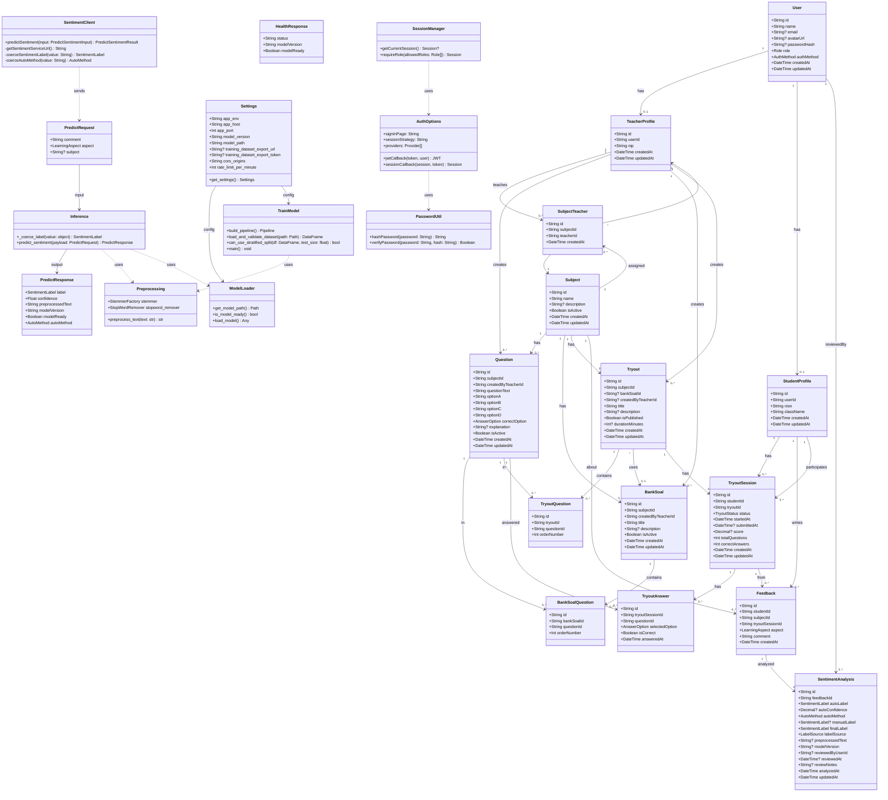

---

## Keterangan Simbol

### Flowchart

| Simbol              | Bentuk Mermaid | Fungsi                |
| ------------------- | -------------- | --------------------- |
| Oval/Terminator     | `([teks])`     | Mulai/Selesai         |
| Persegi/Proses      | `[teks]`       | Proses/operasi        |
| Diamond/Keputusan   | `{teks}`       | Percabangan/kondisi   |
| Jajaran genjang/I-O | `[/teks/]`     | Input/Output          |
| Silinder/Database   | `[(teks)]`     | Database/penyimpanan  |
| Subroutine          | `[[teks]]`     | Proses terdefinisi    |
| Garis putus-putus   | `-.->`         | Relasi include/extend |

### ERD

| Simbol   | Arti         |
| -------- | ------------ | ----- | -------------------------- | ------------------------- | ---------- |
| `        |              | --    |                            | `                         | One to One |
| `        |              | --o   | `                          | One to Zero-or-One        |
| `        |              | --o{` | One to Many (zero or more) |
| `        |              | --    | {`                         | One to Many (one or more) |
| `}o--o{` | Many to Many |

### Class Diagram

| Simbol                | Arti                |
| --------------------- | ------------------- |
| `+`                   | Public              |
| `-`                   | Private             |
| `#`                   | Protected           |
| `-->`                 | Asosiasi (directed) |
| `..>`                 | Dependency          |
| `..>` `uses`          | Uses relationship   |
| `1` / `0..*` / `0..1` | Multiplicity        |
